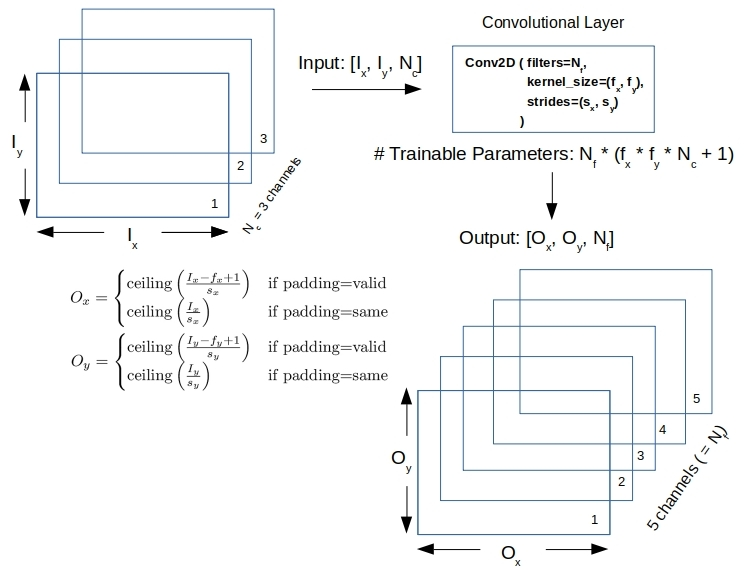
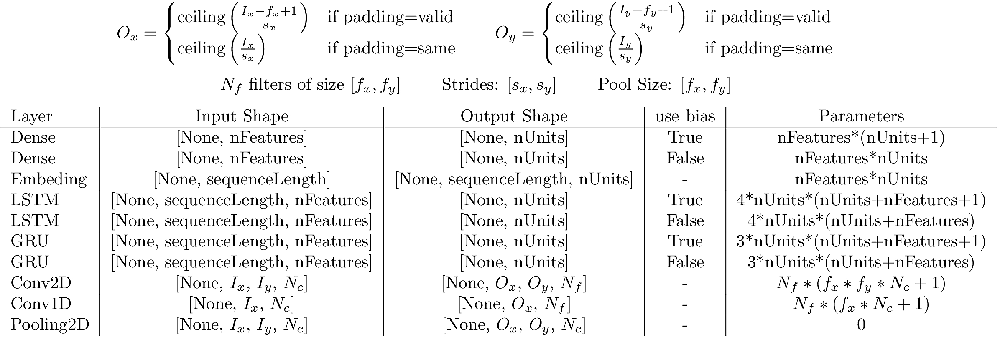

# Reconciling Data Shapes and Parameter Counts in Keras

This is the source code to go along with the blog article

[Reconciling Data Shapes and Parameter Counts in Keras](http://xplordat.com/2019/06/18/reconciling-data-shapes-and-parameter-counts-in-keras/)

Formulae for trainable parameter counts and data shapes are developed for the convolutional and pooling layers in Keras as functions of layer parameters and input characteristics. The results are then reconciled with what Keras reports upon running the models such as the [Visual question answering model](https://keras.io/getting-started/functional-api-guide/#visual-question-answering-model)

Convolutional layers transform the shape of an input matrix/image based on a number of parameters the layer is instantiated with. Here is a summary of what happens when a Conv2D layer is input an image (Keras 2.2.4 and TensorFlow 1.13.1)

## Summary

The table below summarizes the parameter counts and input/output tensor shapes for the layers discussed in this article and the [previous one](http://xplordat.com/2019/06/06/flowing-tensors-and-heaping-parameters-in-deep-learning/ "Flowing Tensors and Heaping Parameters in Deep Learning") in the series

## Dependencies

	keras
	tensorflow
	graphviz
	pydot

# Usage

	pipenv run python ./conv2d.py
	pipenv run python ./pooling.py
	pipenv run python ./vqa_model.py

